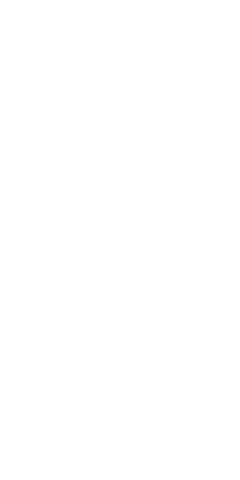

# Demos: stm32

Libraries & Tools

- [bluetooth-serial-port](https://crates.io/crates/bluetooth-serial-port)
- [mpu6050](https://crates.io/crates/mpu6050)
- [rtic](https://rtic.rs/)
- [nalgebra](https://crates.io/crates/nalgebra) `no_std`
- [Godot](https://godotengine.org/)

